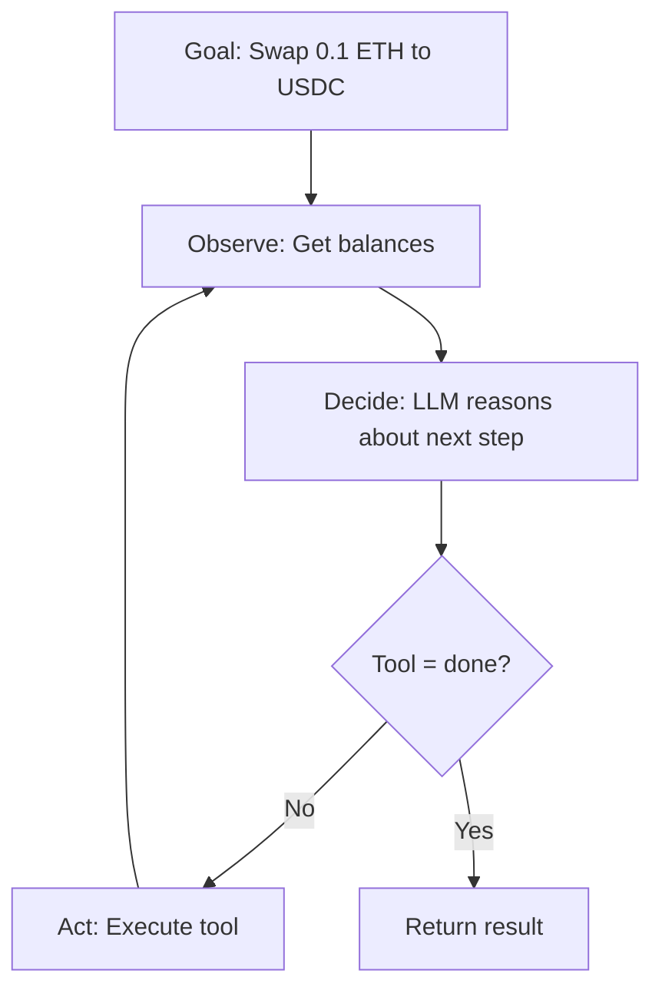

# Agent

Core agent framework — goal-driven autonomous agents with LLM reasoning.

The `Agent` class is the heart of Web3 Agent Kit. It uses an observe-decide-act loop
powered by an LLM to autonomously execute natural language goals on-chain.

---

## Classes

::: src.agent.Agent
    options:
      members:
        - __init__
        - run
        - get_history
      show_root_heading: true
      show_source: true

---

::: src.agent.AgentConfig
    options:
      show_root_heading: true
      show_source: true

---

## Usage

### Basic Agent

```python
from web3_agent_kit import Agent, Wallet, Chain, ChainManager
from web3_agent_kit.defi import Uniswap

chain_manager = ChainManager(chains=[Chain.BASE])
wallet = Wallet.from_env("PRIVATE_KEY", chain_manager=chain_manager)
uniswap = Uniswap(chain_manager=chain_manager)

agent = Agent(
    wallet=wallet,
    chains=[Chain.BASE],
    tools=[uniswap],
    verbose=True,
)

result = agent.run("Swap 0.1 ETH to USDC on Base")
print(result)
```

### With Configuration

```python
from web3_agent_kit import Agent, AgentConfig

config = AgentConfig(
    wallet=wallet,
    chains=[Chain.BASE, Chain.ETHEREUM],
    llm="auto",
    max_steps=20,
    tools=[uniswap],
    governor=governor,
    verbose=True,
)

agent = Agent(config=config)
result = agent.run("Check balances and swap if favorable")
```

### Accessing History

```python
# After running
history = agent.get_history()

for step in history:
    print(f"Step {step['step']}:")
    print(f"  Tool: {step['action'].get('tool')}")
    print(f"  Thought: {step['action'].get('thought')}")
    print(f"  Result: {step['result']}")
```

---

## How It Works



The agent follows an **observe-decide-act** loop:

1. **Observe** — Gathers current blockchain state (balances, gas prices)
2. **Decide** — Sends context + goal to LLM, receives action as JSON
3. **Act** — Executes the action using the appropriate tool
4. **Repeat** — Until goal is achieved or max steps reached
